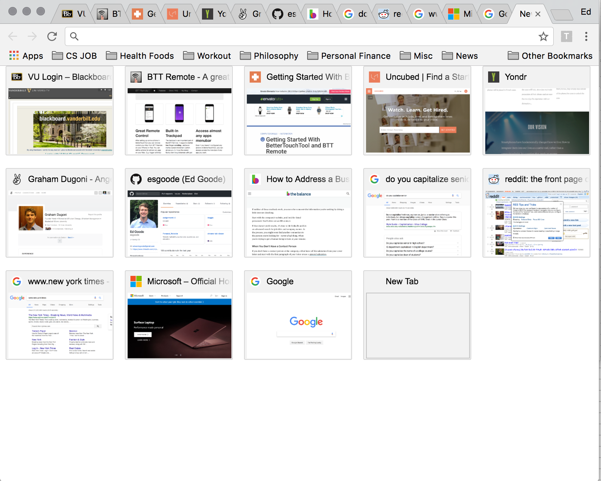

# chrome-tab-viewer

### Goal

1. With this extension the aim is to provide a full page view that shows all open tabs with previews like the default new tab page, but instead of most visited sites, its shows current tabs open.
2. The user should be able to switch to that tab by simply clicking on the box preview of the tab
3. After this is implemented, the goal is to show the last 8 opened pages that were closed in addition to the current opened tabs  
  
---

consider building sound and mute functionality